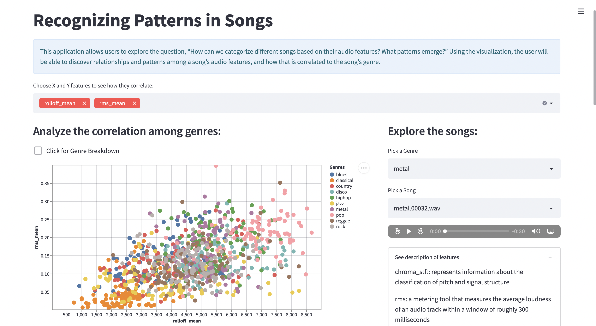

#Recognizing Patterns in Songs 

TODO: Update screenshot

## Abstract 
Ever wonder what determines a song's genre? This application helps you discover characteristics and patterns among songs. By providing linked visualization and audio sample, you will be able to find explore and uncover enjoyable insights. We were able to use a Music Genre Classification dataset, Streamlit, and python library to create this cohesive experience. 

## Dataset
https://www.kaggle.com/dapy15/music-genre-classification/data

## Project Goals

This application allows users to explore the question, “How can we categorize different songs based on their audio features? What patterns emerge?” Using the visualization, the user will be able to discover relationships and patterns among a song’s audio features, and how that is correlated to the song’s genre. 

## Design

Scatterplot - We decided to showcase the overview of the dataset with a scatter plot because it effectively showcases both the correlation between features and the relationship among genres. We included a checkbox to breakdown the scatterplot by genre allows for a focused view for the user. 

Simple Strip Plots - We used a simple strip plot, because it allowed the user to get a zoomed-in view of the features, and how they relate to one another. With the linking interaction and the close orientation, the user is able to see how the selected songs compare among the provided audio features. These plot can also be used to manipulate the scatterplot, and easily make other comparisons. 

Audio Files - We decided the presence of the audio file was a useful addition because it allows the user another way of interacting and exploring the data. Song is an auditory experience, so allowing the user to hear the audio allows for better engagement and insightful comparisons. 

HeatMap 

Pie Chart - We added a pie chart in an expander tab. This is an optional visualization that the user can view if they would like a breakdown of the genres in the dataset. 

Alternatives: We primarily used our initial ideas, because we found it best fit our dataset. We consider using a bar chart, but did not see it providing much details not already shown in the other visualization. 

## Development

The development process began with analyzing potential datasets to use for the application. Before settling on a dataset, we explore the various dataset and potential questions that the dataset could potentially solve for use. We settled on Music Genre Classification because it provided the ability to use 30 second audio files, and provided unique audio data that allowed both the user and us to discover something new about audio features. 

To gain more domain knowledge, we researched the features presented in the data. It was important to understand the features, so we could effectively design the appropriate data visualizations for user exploration. 

After we conclude our research, we create various sketches to test out potential visualization and design orientations. After our group discussion, we began to implement our design. We divided the work into two sections. Maral handles the heatmap and pie chart visualization, and Joshua worked on the scatterplot and strip plot visualization, as well as implementing the audio file selection. 

## Success Story

The best thing about this project was that our team was able to learn something new as well. We were weary of the challenge because we weren’t sure if we had time to properly understand the features presented in the dataset. The surprising thing about this project was that we were able to learn while exploring the dataset and testing various visualizations. 

## Description of features

chroma_stft: represents information about the classification of pitch and signal structure

rms: a metering tool that measures the average loudness of an audio track within a window of roughly 300 milliseconds

rolloff: denotes the approximate low bass and high treble limits in a frequency response curve, with all frequencies between being those a speaker will play accurately

harmony: the process by which the composition of individual sounds, or superpositions of sounds, is analysed by hearing.

tempo: how fast or slow a piece of music is performed
